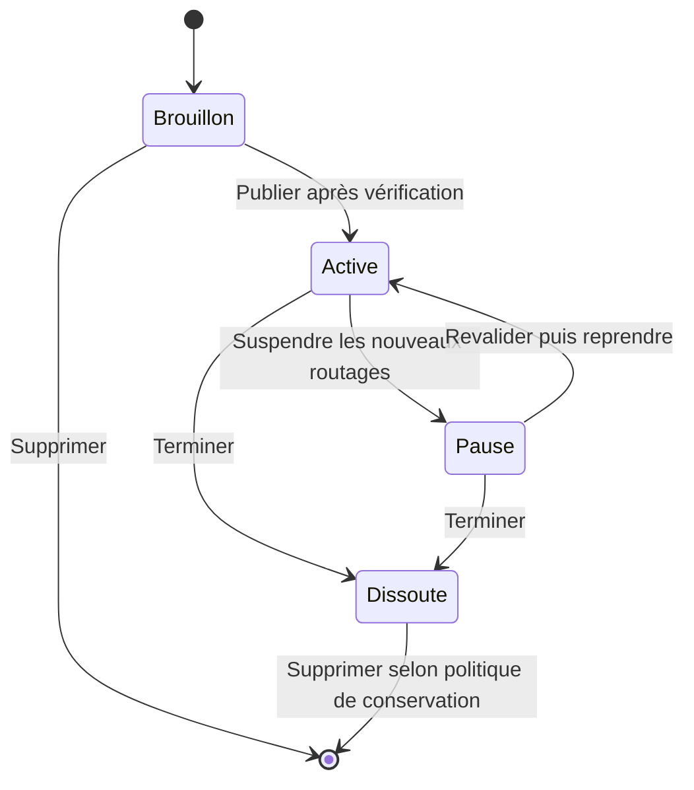
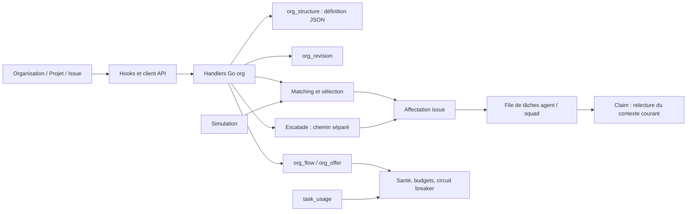

# Audit fonctionnel, UX et architecture — Organisation

Date : 8 septembre 2026. Statut : **audit terminé ; proposition de conception, aucune correction applicative livrée par cet audit**.

## Lecture du verdict

L'organisation n'est pas encore un produit cohérent de composition et de pilotage. L'ajout d'un agent et l'ajout d'une équipe sont maintenant séparés dans les opérations, mais la navigation, les actions et les règles d'exécution ne respectent pas toujours cette séparation. Plusieurs fonctions peuvent être configurées sans être exécutées ; les sept modèles ne disposent pas des représentations et des parcours spécifiques que leur nom laisse attendre.

Les causes principales sont : un modèle métier qui mélange plusieurs dimensions, un éditeur commun sans commandes contextuelles, des chemins de création différents, et une logique de décision répartie entre simulation, routage, escalade et prise en charge des tâches.

Ce rapport ne considère ni un bouton présent, ni un champ JSON, ni un test de composant comme preuve qu'une capacité est utilisable de bout en bout.

## Périmètre et méthode

**Version examinée :** `/Users/jeff/orca/vigil-org-integrated`, commit `a8cccd52ae5eaa74c895ef00fc53a8d67e462a69`, correspondant au frontend installé `0.4.43-34-ga8cccd52a`. Aucun changement serveur entre `929858ef1` et ce commit : les sources serveur correspondent à la base du backend précédemment installé. Ce n'est pas une nouvelle attestation d'identité du processus serveur.

Les références de code ci-dessous sont relatives à ce worktree. Les captures anciennes envoyées par l'utilisateur montrent une itération antérieure ; elles motivent l'audit mais ne prouvent pas l'état exact de la dernière version.

Méthodes utilisées :

- reverse-engineering-business-logic : remontée des écrans aux API, décisions et écritures ;
- domain-modeling : séparation des concepts et invariants ;
- analyzing-business-logic-gaps : états, transitions, exceptions, concurrence, coûts, responsabilités ;
- critique + impeccable : évaluation UX indépendante et inventaire déterministe ;
- multi-agent-systems, workflow design-delegation-ux : conséquence d'une délégation, visibilité, provenance et interruption.

Deux évaluations indépendantes ont été réalisées : A, revue UX avec navigation dans un aperçu local utilisant les vrais composants et une API de démonstration ; B, inventaire statique et détecteur. Les observations de l'aperçu prouvent les comportements de présentation, pas les mutations du backend réel.

Le détecteur `npx impeccable detect --json packages/views/org/components` retourne `[]`, code 0, sur 18 fichiers TSX (12 composants, 6 tests). **Ce résultat ne valide ni les parcours, ni l'accessibilité complète, ni l'implémentation des modèles.**

Légende des preuves : **C** = confirmé dans les sources actuellement raccordées ; **V** = constaté par navigation dans l'aperçu ; **R** = risque déduit du code, sans injection de panne/concurrence ; **D** = décision produit encore à trancher. Aucun agent réel n'a été lancé, aucune organisation réelle modifiée pour cet audit.

Sévérité : **P1** résultat métier incorrect ou promesse d'exécution trompeuse ; **P2** parcours bloqué, ambigu ou incomplet ; **P3** amélioration de présentation. Aucun P0 établi.

## 1. Finalité métier

Permettre à une personne de :

1. définir un périmètre de travail et un résultat attendu ;
2. composer des équipes de personnes et d'agents ;
3. attribuer missions, rôles, responsabilités et destinataires ;
4. définir les relations et les règles de traitement ;
5. comprendre le résultat d'une demande avant activation ;
6. activer une configuration vérifiée, puis suivre et corriger son fonctionnement.

La composition visuelle doit rester une manipulation déterministe de données. L'exécution peut ensuite déléguer du travail à des agents. Ces deux moments doivent être explicitement distingués dans les libellés et dans les effets.

## 2. Acteurs et vocabulaire

| Concept | Réalité actuelle | Clarification nécessaire |
|---|---|---|
| Espace de travail | Périmètre des humains, agents, projets et droits | L'annuaire global appartient à ce niveau |
| Organisation / structure | Configuration de coordination pour un projet, ou défaut de l'espace | Une configuration n'est ni une entreprise supplémentaire ni une équipe |
| Équipe | `OrgUnit` avec mission, membres, responsable et politiques | Une équipe peut être vide en construction ; elle doit expliquer pourquoi elle ne reçoit pas encore de travail |
| Personne | Identité humaine du workspace | Inviter une personne crée un accès ; l'affecter à une équipe ne crée pas d'identité |
| Agent | Identité d'exécution existante dans le workspace | Créer un agent, affecter un agent et désigner le destinataire sont trois actions |
| Membre d'équipe | Relation acteur ↔ équipe, avec au plus un `role_id` aujourd'hui | Plusieurs équipes possibles ; déplacement et ajout supplémentaire doivent être explicites |
| Responsable humain | `owner_id` de l'équipe ou de la structure | La supervision ne signifie pas automatiquement appartenance à la liste des membres |
| Rôle | Fonction locale à une équipe, avec responsabilités et mots-clés | Le titulaire doit être distinct du rôle et du destinataire par défaut |
| Squad | Objet séparé avec son leader et sa composition | Son rattachement à une équipe peut faire exécuter une autre composition que celle affichée |
| Relation | Rattachement, escalade, remplacement, consultation | Chaque relation doit annoncer son sens, ses conditions et son effet réel |
| Modèle | Enum globale et éventuelle surcharge par unité | Mélange actuellement topologie, sélection, gouvernance et durée de vie |
| Vue / chart | Tableau ou graphe de la même définition | Changer de vue ne doit jamais changer la sémantique de l'organisation |

Sources : [types serveur](../../../../server/internal/handler/org.go:100), [sélecteur réel de destinataire](../../../../server/internal/handler/org.go:1355), [éditeur](../../../../packages/views/org/components/org-editor.tsx:31).

## 3. Préconditions, accès et états d'entrée

- Authentification et appartenance au workspace pour les API de structure et simulation.
- Une seule structure non dissoute par projet, et une seule structure par défaut non dissoute. Un brouillon occupe donc déjà ce périmètre.
- Création et modification accessibles aux membres ; suppression réservée côté serveur aux propriétaires/administrateurs du workspace.
- Catalogue métier installable seulement par propriétaire/administrateur.
- Les unités sans responsable humain sont ignorées par le routage ordinaire, même si elles contiennent des agents.
- Une organisation active n'implique pas que toutes ses unités soient opérationnelles.
- L'autonomie possède bien quatre valeurs ; elle ne doit pas être confondue avec le statut brouillon/actif de la structure.

**Incohérence d'accès :** le frontend autorise aussi le propriétaire de la structure à voir la suppression, mais le serveur exige owner/admin du workspace. Résultat : action proposée puis refusée. P2, C. Sources : [canDelete](../../../../packages/views/org/components/org-page.tsx:305), [DeleteOrgStructure](../../../../server/internal/handler/org.go:1144).

**Question produit :** tous les membres doivent-ils pouvoir publier, suspendre et dissoudre une structure ? Le code le permet ; sans règle métier contraire, ce rapport ne qualifie pas cela de faille de droits. D.

## 4. Parcours et inventaire des écrans

Toutes les surfaces raccordées à Organisation ont été recensées. Les dialogues mutateurs ont été examinés dans le code ; leurs effets n'ont pas été déclenchés sur les données réelles.

| Surface / intention | État actuel et incohérence | Comportement attendu |
|---|---|---|
| Entrée Organisation | Sélecteur + dernière sélection/défaut, puis liste séparée. Périmètre et sélection ne sont pas un lien explicite vers une structure | Entrée stable, scope visible, accès direct partageable |
| Toutes les organisations | Recherche et liste plus compactes ; état vide parle de « première équipe » mais lance une organisation | Nommer l'objet créé et expliquer le périmètre |
| Assistant — besoin | Besoin utilisé par une heuristique de mots-clés ; modèles métier et modèles de coordination sont deux catalogues distincts | Proposition expliquée, métier modifiable et limites de l'assistant visibles |
| Assistant — fonctionnement | Sept modèles simples ; composite exclu du picker principal | Montrer les capacités réelles et les combinaisons compatibles |
| Assistant — membres | Affectations explicites, mais un emplacement initial par acteur et structure préfabriquée | Composer librement, conserver un brouillon incomplet, autoriser plusieurs appartenances intentionnelles |
| Assistant — revue | Aperçu avant création, mais pas une preuve de fonctionnement complet | Résumer objets créés, règles, rôles vacants et étapes restantes |
| Composer → Équipes | Tableau et répertoire, deux boutons Ajouter une équipe ; responsable et membres distincts, destinataire générique | Action principale équipe, affectation directe, rôle/destinataire lisibles selon le modèle |
| Composer → Relations | Le bouton principal reste **Ajouter une équipe**. Les relations se créent dans la fiche d'une équipe. Pas d'édition directe d'un lien | **Créer une relation** : source, type, cible, conditions ; sélectionner un lien pour le modifier |
| Composer → Annuaire | Le bouton principal reste **Ajouter une équipe**. Pas de recherche/filtre/action d'affectation dans cette vue ; création d'agent uniquement dans le répertoire du tableau | Rechercher ; filtrer humains/agents/non affectés ; affecter ; accès au profil ; créer un agent/inviter selon droits |
| Annuaire → responsable | Ouvre Fonctionnement alors que le responsable est dans Équipe ; bascule aussi la vue sous-jacente vers Relations | Ouvrir le bon champ, conserver la provenance et revenir dans Annuaire |
| Fiche → Équipe | Nom, mission, responsable, membres, rôles, destinataire dans un long panneau modal | Section identité/composition lisible ; règles avancées progressives ; rôle et destinataire cohérents |
| Fiche → Fonctionnement | Modèle effectif, squad, autonomie, budgets, contraintes et décideurs | Formulaire adapté aux capacités, héritage visible et effet expliqué |
| Fiche → Relations | Mélange règles d'aiguillage et relations entre équipes | Distinguer « quelle demande arrive ici » de « avec qui cette équipe travaille » |
| Ajouter une équipe | Nom/responsable/parent ; crée toujours `kind: "unit"`. Texte parent facultatif mais obligatoire en hiérarchie | Champ conditionnel expliqué ; choix de fonctionnement pertinent ; brouillon autorisé |
| Ajouter des membres | Sélecteur d'acteurs existants correctement séparé de création d'équipe | Conserver ; indiquer les appartenances et distinguer ajout/déplacement |
| Créer un agent | Quitte Organisation vers la page agents ; pas de retour/affectation transmis par cet appel | Retour vers l'équipe d'origine, puis proposition d'affectation |
| Tester une demande | Vraie API en lecture seule, mais résultat partiel pour marché, risque et décideur | Explication structurée : règle, équipe, titulaire, décision, blocage, incertitudes |
| Activer | Saisie libre d'une attestation, indicateurs approximatifs et exigences techniques | Checklist exécutable liée à la révision et accès direct aux corrections |
| Publier une modification active | Confirmation présente ; résumé surtout noms d'équipes/sections | Voir précisément les effets sur destinataire, relations, politiques et demandes futures |
| Suivre | Compteurs et tableau ; peu de passage direct du symptôme à la correction ; identifiants d'agents saturés affichés tels quels | Cliquer incident → demandes concernées → cause → correction → nouveau test |
| Historique / comparer | Révisions persistantes ; différences de relations/règles résumées par section, détails dans JSON | Comparaison métier avant/après et portée exacte de la restauration |
| Paramètres | Propriétaire, budget, fin, comités et marché ensemble pour tous les modèles | Champs pertinents au fonctionnement choisi ; pas de JSON nécessaire aux tâches métier |
| Pause / reprise | Pause des futurs routages ; reprise serveur sans revalidation | Énoncer le sort des tâches en cours et appliquer une transition contrôlée |
| Dissolution / suppression | Fin de routage puis suppression distincte ; certaines promesses de nettoyage non garanties | Prévisualiser les conséquences réelles et rapporter les opérations réussies/échouées |
| Modèles métier | Installe un ensemble comprenant projet, agents, skill, organisation, autopilot et issue | Nommer « installer un kit métier », permettre revue des objets et ouvrir le résultat |
| Import / export | Ouvre le transfert workspace depuis la liste ; ce n'est pas un export de chart | Afficher clairement le périmètre et distinguer bundle de données / image du chart |
| Projet → Organisation | Autre parcours : clic sur template crée immédiatement ; composite accessible ici ; lien générique vers Organisation | Réutiliser le même assistant contextualisé et ouvrir la structure créée |
| Issue → Organisation | Offre marché, routage et escalade réels ; succès affiché sur réponse HTTP même sans nouvelle affectation | Séparer décision trouvée, affectation, attente d'approbation et tâche démarrée |

Sources principales : [page](../../../../packages/views/org/components/org-page.tsx:357), [éditeur](../../../../packages/views/org/components/org-editor.tsx:82), [tableau](../../../../packages/views/org/components/org-team-board.tsx:50), [assistant](../../../../packages/views/org/components/org-wizard.tsx:181), [catalogue](../../../../packages/views/org/components/org-team-catalog.tsx:18), [entrée projet](../../../../packages/views/projects/components/project-org-section.tsx:32), [entrée issue](../../../../packages/views/org/components/issue-org-section.tsx:23).

### États transversaux

| État | Ce qui est présent | Manque ou réserve |
|---|---|---|
| Chargement / erreur réseau | Erreurs et réessais page, catalogue, santé, membres ; chargements de plusieurs panneaux | Pas de validation exhaustive hors ligne ; chargement de membres traité comme liste vide dans certaines projections |
| Vide | Instructions pour équipe vide et liste vide | Mauvais objet nommé dans la liste ; relations vides sans parcours de création contextuel |
| Brouillon modifié | Persistance du brouillon et alerte de conflit de révision | Les erreurs de validité bloquent l'enregistrement serveur du brouillon, ce qui mélange construction et publication |
| Lecture seule | Structure dissoute et champs désactivés | Le statut opérationnel des équipes doit aussi rester intelligible dans toutes les vues |
| Sans autorisation | Catalogue protégé dans l'UI | Suppression frontend/backend incohérente |
| Grand volume | Recherche du répertoire, membres repliés après cinq, scroll | Annuaire sans recherche ; graphe réduit jusqu'à 30 %, sans preuve de lisibilité à grande taille |
| Mobile / petite fenêtre | Quelques grilles adaptatives et scroll | Aucun audit complet d'app mobile native, lecteur d'écran, tactile ou contraste mesuré dans cette passe |

### Formes d'équipes et de charts : couverture réelle

Les sept enums existent. Cela ne signifie pas sept systèmes aboutis.

| Modèle | Ce qui fonctionne effectivement | Manque fonctionnel / représentation |
|---|---|---|
| Hiérarchie | Racine, rattachements, routage, escalade, approbation sur risque configuré | Les relations et leur édition restent difficiles à lire ; états opérationnels peu visibles ; approbation et escalade divergent |
| Squads | Destination vers une squad liée, sinon agent de l'unité | Équipe et squad sont deux objets pouvant avoir deux compositions ; aucune vue intégrée de cette différence |
| Matrice | Plusieurs rattachements et choix par compétence historique de domaine | Pas d'axes métier/projet, d'allocation, ni de capacité ; sélection ne tient pas compte de disponibilité/coût ; héritage dépend du premier parent |
| Cercles | Rôles, mots-clés et affectations stockés ; mots-clés peuvent choisir l'unité | Titulaire du rôle non utilisé pour choisir l'exécutant ; comités sans exécution de vote/consentement ; pas de vue de cercles/rôles |
| Réseau de responsables | Règles labels/chemins/mots-clés vers une unité | Remplaçants et consultations sans consommateur d'exécution trouvé ; pas de carte des domaines et de couverture |
| Task force | Fin par date ou certaines conditions, tentative de postmortem | Pas de modèle de prêt/allocation temporaire ni de retour d'appartenance ; conditions invalides acceptées ; pas de vue temporelle |
| Marché | Classement de candidats calculé par serveur selon compétence, coût historique et file ; plafond/minimum d'offres | Pas d'offres proposées par les agents ; simulation et carte n'annoncent pas le vrai candidat ; paramètres globaux et aucune vue marché dans Organisation |
| Composition hybride | Modèle par unité et template composite côté serveur | Template caché dans l'assistant principal, visible depuis projet ; héritage ambigu avec plusieurs parents ; aucun parcours dédié |

Les charts raccordés sont un tableau générique et un graphe organisé par profondeur de `reports_to`. Pour les trois autres relations, l'algorithme reçoit une liste d'arêtes vide avant de dessiner les liens filtrés. Il ne s'agit donc pas de layouts adaptés aux cercles, matrices, marchés ou réseaux.

**Composants orphelins :** `OrgCanvas` et `OrgPeopleChart` n'ont plus de consommateurs de production dans `packages/` ou `apps/` ; `OrgUnitSheet` n'est atteint que par eux. Les tests de ces composants ne couvrent pas la page installée. Il faut décider de réutiliser ce qui est pertinent ou supprimer le code mort, sans entretenir deux éditeurs concurrents.

Sources : [modèles et templates](../../../../server/internal/handler/org.go:348), [modèles d'unité](../../../../packages/views/org/components/org-editor.tsx:26), [layout actif](../../../../packages/core/org/editor.ts:6), [branche de vue](../../../../packages/views/org/components/org-editor.tsx:61), [ancien canvas](../../../../packages/views/org/components/org-canvas.tsx:282).

### Écarts UX supplémentaires confirmés par la revue indépendante

- **F34 — P1 C : comparaison trompeuse.** Pour les changements de relations, règles, comités ou marché, `orgDefinitionChanges` renvoie une section sans objets avant/après. Le comparateur les rend comme des unités absentes des deux côtés. Changer destinataire, propriétaire, permissions ou budget peut produire deux résumés identiques. Modifier seulement les métadonnées de structure peut laisser le résumé de publication vide. [calcul](../../../../packages/core/org/editor.ts:106), [comparaison](../../../../packages/views/org/components/org-page.tsx:455)
- **F35 — P2 C : choix de template incomplet.** Le wizard conserve `tpl.model`, pas sa définition ; il reconstruit les unités depuis la proposition métier. Projet utilise au contraire la définition serveur. Le même choix apparent peut donc créer un autre résultat. Les choix guidé et manuel de task force diffèrent aussi. [assistant](../../../../packages/views/org/components/org-wizard.tsx:107), [sélection](../../../../packages/views/org/components/org-wizard.tsx:267), [construction](../../../../packages/core/org/templates.ts:293)
- **F36 — P2 C : simulation étiquetée active à tort.** Hors brouillon modifié, le libellé du test emploie `basis_active`, y compris pour paused/dissolved. Distinguer base simulée et organisation pouvant recevoir du travail. [testeur](../../../../packages/views/org/components/org-tester.tsx:43)
- **F37 — P2 C/V : contexte de relation masqué.** Les labels des liens apparaissent à la sélection, mais la feuille modale masque/floute alors le graphe. Les liens entrants ne sont pas listés dans la fiche ; les cases d'approbation n'ont pas de libellé visible. [graphe](../../../../packages/views/org/components/org-editor.tsx:131), [fiche](../../../../packages/views/org/components/org-editor.tsx:200)
- **F38 — P2 C : sens divergent de « sans équipe ».** Le répertoire compte seulement les appartenances ; l'annuaire prend aussi en compte la responsabilité. Une même personne peut être considérée affectée dans une vue et non affectée dans l'autre. [répertoire](../../../../packages/views/org/components/org-team-board.tsx:64), [annuaire](../../../../packages/views/org/components/org-editor.tsx:113)
- **F39 — P2 C : correction éloignée du problème.** Erreurs textuelles sans accès au champ, parfois masquées derrière la fiche. Le drag annonce une affectation sans préciser le retrait du rôle local et du statut de destinataire lors d'un déplacement. [problèmes](../../../../packages/views/org/components/org-problem-list.tsx:15), [affectation](../../../../packages/views/org/components/org-team-board.tsx:66)

### Évaluation UX indépendante

**22/40 sur la grille de Nielsen du skill critique.** Appréciation experte du périmètre inspecté, sans prétention de benchmark quantitatif ou d'étude utilisateurs.

| Heuristique | /4 | Motif |
|---|---:|---|
| Visibilité de l'état | 3 | Brouillon, conflit et erreurs visibles |
| Correspondance métier | 1 | Modèle, forme, squad et destinataire mal distingués |
| Contrôle et liberté | 3 | Annulation et alternatives au drag ; retours erronés |
| Cohérence | 1 | Annuaire/répertoire et Projet/wizard divergents |
| Prévention des erreurs | 3 | Contrôles présents ; conséquences peu exposées |
| Reconnaissance | 2 | Membres visibles, héritage et corrections difficiles à retrouver |
| Efficacité | 3 | Recherche du répertoire, drag et affectation |
| Esthétique et minimalisme | 2 | Plus sobre, cartes/formulaires répétitifs, contexte masqué |
| Récupération | 2 | Brouillon conservé, comparaison insuffisante |
| Aide contextualisée | 2 | Notes améliorées, préparation des modèles incomplète |

Cinq critères de charge cognitive sur huit sont insuffisants : objectif unique, hiérarchie des actions, une décision à la fois, nombre de choix, continuité du contexte. Groupement, recherche du répertoire et dévoilement progressif sont favorables.

- **Jordan, débutant** : distingue mieux équipe/membres, mais doit deviner le rôle de Fonctionnement, Squad et Annuaire.
- **Alex, expérimenté** : gagne avec le drag, perd dans les retours de vue et la comparaison de publication.
- **Sam, clavier/lecteur d'écran** : bénéficie des formulaires et alternatives au drag, mais pas d'une lecture globale des relations. Les boutons utilisent `aria-pressed` plutôt qu'un contrat complet d'onglets ; les liens SVG sont cachés à l'accessibilité. Un équivalent textuel navigable est nécessaire.

Couverture visuelle de A : page, sélecteur, Équipes, Relations, Annuaire, répertoire, trois sections de fiche, Suivre, Historique/comparaison, Paramètres ; état initial du test et du catalogue, première étape du wizard. Autres étapes et transitions analysées dans le code, sans mutation. Aucun score de conformité WCAG revendiqué.

## 5. Règles de décision : écarts prioritaires

| ID | Niveau / preuve | Déclencheur → comportement actuel → impact | Correction de fond |
|---|---|---|---|
| F01 | P1 C | Cercle : mot-clé d'un rôle trouve l'équipe, puis le sélecteur prend squad/lead/premier agent. Le titulaire configuré n'est pas utilisé | Conserver le rôle résolu dans le résultat de routage et choisir son titulaire, avec fallback explicite |
| F02 | P1 C | Lien remplacement/consultation créé : enregistré et dessiné ; aucun consommateur runtime trouvé | Implémenter conditions/effets, ou présenter clairement comme relation documentaire |
| F03 | P1 C | Comité configuré : quorum/tours validés ; pas de moteur de décision org raccordé | Ne pas annoncer de gouvernance exécutable avant liaison au mécanisme de décision |
| F04 | P1 C | Matrice à deux parents : modèle effectif prend le premier parent ; escalade prend le dernier lien applicable | Définir une autorité d'héritage explicite et une priorité d'escalade, indépendantes de l'ordre JSON |
| F05 | P1 C | Carte « destinataire » : lead/premier agent affiché alors que matrice ou marché peuvent choisir quelqu'un d'autre | Afficher la politique de sélection ; ne nommer un exécutant que pour une demande résolue |
| F06 | P1 C | Marché sans membres agents : recherche élargie à tous les agents du workspace | Périmètre explicite ; vide ne doit pas signifier automatiquement tous |
| F07 | P1 C | Escalade vers une unité suspendue : ne passe pas par le filtre `orgMatchUnit`. Marché cible : ne lance pas `orgMarketRound` | Réutiliser les mêmes règles d'éligibilité et de sélection à chaque entrée |
| F08 | P1 C | Case approbation humaine d'un lien : sauvegardée, mais l'escalade n'en consulte pas la valeur | Garantir l'approbation avant l'effet ou corriger la promesse du champ |
| F09 | P2 C | `approval_risk` décrit comme seuil ; comparaison réelle par égalité, champ absent du formulaire courant | Définir niveau exact ou seuil ordonné ; exposer uniquement la sémantique réellement exécutée |
| F10 | P2 C | Plusieurs prédicats dans une règle : OR entre labels/chemins/mots-clés, priorité puis spécificité, égalité départagée implicitement | Montrer la logique « au moins un », l'ordre et les collisions avant publication |
| F11 | P2 C | Squad liée prioritaire malgré une autre liste de membres/destinataire de l'unité | Montrer le roster d'exécution de la squad et la relation avec l'équipe |
| F12 | P2 C | Unité sans responsable reçoit zéro demande, même avec agents | État « à compléter » et correction directe, distincts de l'autonomie et du statut global |

Preuves : [matching](../../../../server/internal/handler/org.go:1270), [sélection](../../../../server/internal/handler/org.go:1355), [héritage](../../../../server/internal/handler/org.go:189), [escalade](../../../../server/internal/handler/org_ops.go:45), [marché](../../../../server/internal/handler/org.go:1532), [comités et relations validés](../../../../server/internal/handler/org.go:608), [destinataire affiché](../../../../packages/views/org/components/org-team-board.tsx:28).

### Simulation et activation

- **F13 — P1 C : simulation marché non fidèle.** L'API utilise le sélecteur générique pour « prépare », sans calculer la compétition. Une note précise l'absence de marché simulé, mais un nom reste affiché comme exécutant. Il faut produire un classement sans effet, ou une réponse explicitement indéterminée. [simulation](../../../../server/internal/handler/org_simulate.go:150)
- **F14 — P1 C : preuve non liée à la révision.** L’interface décrit correctement une attestation manuelle ; elle ne promet pas une évaluation automatique. Le serveur exige seulement un texte non vide, sans vérifier un identifiant d’évaluation, un résultat ou son lien avec la révision. Une modification active peut réutiliser l’attestation précédente alors que l’exigence serveur cite la révision courante. [activation](../../../../server/internal/handler/org.go:699), [mise à jour](../../../../server/internal/handler/org.go:935)
- **F15 — P2 C : risque absent de la simulation.** La requête simulée n'a pas de `ContractRisk`. L'approbation est racontée dans une note, pas réellement résolue pour le cas soumis. [requête](../../../../server/internal/handler/org_simulate.go:29)
- **F16 — P2 C : décideur ambigu.** La simulation retourne le premier décideur disponible selon l'ordre des classes, sans classe de décision demandée. « Qui décide ? » peut donc désigner une responsabilité sans rapport avec la demande. [orgDeciderFor](../../../../server/internal/handler/org_simulate.go:223)
- **F17 — P2 C : refus approximatifs.** Les refus sont rapprochés du texte par classes et racines de mots. C'est une aide de prévisualisation, pas la preuve qu'un outil réel sera autorisé ou refusé. Le résultat doit distinguer « risque détecté dans la demande » et « règle appliquée à l'appel d'outil ». [orgBlockingDenies](../../../../server/internal/handler/org_simulate.go:239)

## 6. États et transitions

### Ce qui existe

`draft`, `active`, `paused`, `dissolved` décrivent la structure. L'autonomie de l'unité et son éventuelle suspension par circuit breaker sont séparées, mais l'interface ne montre pas toujours cette distinction.

**F18 — P1 C : reprise contournant l'activation.** Le handler accepte `resume` et met `active` sans vérifier l'état de départ ni appeler `orgActivationCheck`. Seul l'état dissous est rejeté. Un appel direct brouillon → reprise peut donc activer sans les contrôles du chemin « activer ». La route n'ajoute aucune garde métier. Aucune mutation réelle n'a été effectuée pour démontrer ce chemin. [handler](../../../../server/internal/handler/org.go:1070), [route](../../../../server/cmd/server/router.go:2511)

**F19 — P1 C : fin de task force parfois impossible.** `all_issues_done` est accepté sans projet alors que le calcul exige un projet ; `budget_spent` est accepté avec budget nul alors que le calcul exige un budget positif. Toute chaîne non vide peut satisfaire la présence d'une condition à l'activation, mais seules deux valeurs sont exécutées. [contrôle](../../../../server/internal/handler/org.go:699), [fin](../../../../server/internal/handler/org_ops.go:401)

**F20 — P2 C : reprise d'une unité mal annoncée.** L'alerte conseille de sauvegarder une révision pour reprendre. Le calcul de suspension regarde tout événement breaker des dernières 24 h, sans filtre de révision ; la sauvegarde ne supprime pas ces événements. La promesse n'est donc pas soutenue par ce chemin. [alerte](../../../../server/internal/handler/org_ops.go:478), [filtre](../../../../server/internal/handler/org.go:1250)

**F21 — P2 C : arrêt et dissolution.** Ces actions stoppent les futurs routages org ; elles n'annulent pas les tâches déjà en file ou en cours dans les handlers examinés. La notification de dissolution affirme que le postmortem a été créé et que les membres sont revenus, même si la création n'a pas eu lieu ou a échoué. Aucun modèle de retour d'appartenance n'est modifié ici. [dissolution](../../../../server/internal/handler/org_ops.go:432)

### Machine d'états proposée

Publier une modification d'une organisation active doit être une transition versionnée : ancienne définition en service, nouvelle définition en préparation, activation atomique de la nouvelle version. Une révision restaurée repasse par les mêmes contrôles. Il faut décider séparément du traitement des tâches en cours ; ne pas modifier silencieusement leur contexte.

## 7. Coûts, budgets et mesures

**F22 — P1 C : dépenses attribuées plusieurs fois.** `SumOrgUnitSpendSince` additionne les usages des tâches d'une issue dès qu'elle a déjà été routée vers l'unité. Si cette issue passe de A à B, ses mêmes usages peuvent être comptés dans A et B. Une somme de ces montants peut déclencher trop tôt un budget de task force ou produire de faux totaux d'organisation. La requête n'attribue pas le coût au contexte du run. [requête](../../../../server/pkg/db/queries/org.sql:81)

**F23 — P2 C : fenêtres différentes.** Les flux sont présentés sur sept jours ; la dépense utilise un mois glissant calculé avec `AddDate(0,-1,0)`. Les mesures doivent porter leur propre fenêtre et leur unité. [santé](../../../../server/internal/handler/org_ops.go:230)

**F24 — P2 C : coût inconnu traité comme zéro.** Préflight, marché et santé utilisent parfois zéro en absence de données ou après erreur ignorée. « Inconnu » ne vaut pas « gratuit » ; moyenne historique et coût de la demande doivent être distingués. [préflight](../../../../server/internal/handler/org.go:1178), [marché](../../../../server/internal/handler/org.go:1561)

**F25 — P2 C : compteurs sans retour au travail.** Les routages sont des événements, pas nécessairement des issues uniques ; les agents saturés apparaissent par ID et la liste ne mène pas directement aux tâches concernées. [tableau de santé](../../../../packages/views/org/components/org-page.tsx:194)

Proposition : attribuer chaque coût à un run et au contexte organisation/équipe/révision effectivement utilisé. Compter séparément demandes uniques, décisions de routage, reprises et escalades. Afficher date de calcul, fenêtre et couverture des données. Ne pas présenter le plafond de prix du marché comme une limite ferme de dépense d'exécution.

## 8. Exceptions, concurrence et reprise

| ID | Niveau / preuve | Constat | Conséquence et action |
|---|---|---|---|
| F26 | P1 C | Affectation écrite, puis erreur d'enqueue seulement journalisée ; le handler retourne l'issue affectée | « Routé » peut masquer « non démarré ». Enregistrer et exposer les états distincts, avec reprise sûre |
| F27 | P2 C | Création structure puis première révision dans deux appels sans transaction locale | Une panne intermédiaire peut laisser une structure sans révision initiale ; transaction requise |
| F28 | P2 C | Changement de statut sans incrément de révision ni contrôle expected_revision | L'historique ne reflète pas toutes les transitions ; versionner/contrôler les mutations |
| F29 | P2 R | Quota d'escalade et offres : compte puis écritures séparées ; routage déclenché de plusieurs entrées | Course possible et duplications à vérifier sur DB de test ; clé d'idempotence et garde atomique au point commun |
| F30 | P2 C | Suppression d'une structure n'efface que org_structure ; aucun FK/cascade et aucun nettoyage explicite dans ce handler | Révisions, flux et offres conservés sans politique explicite ; décider conservation d'audit ou purge transactionnelle |
| F31 | P2 C | Historique restaure définition/modèle, pas nom, propriétaire, budget et conditions de fin | « Restaurer » n'est pas restaurer toute la configuration ; étendre le snapshot ou annoncer sa portée |
| F32 | P2 C | Au claim, contexte relu dans la structure courante ; pas nécessairement la révision du routage | Une tâche en attente peut recevoir une autre politique ; fixer une règle explicite de version applicable |
| F33 | P2 C | Simulation/routage/escalade utilisent des sous-ensembles différents des mêmes règles | Aucun résultat de prévisualisation fiable de bout en bout avant unification |

Sources : [affectation](../../../../server/internal/handler/org.go:1390), [création](../../../../server/internal/handler/org.go:914), [statut](../../../../server/pkg/db/queries/org.sql:27), [suppression](../../../../server/pkg/db/queries/org.sql:32), [restauration](../../../../server/internal/handler/org.go:935), [claim](../../../../server/internal/handler/org_ops.go:504).

Ces constats ne signifient pas que toutes les transactions de l'application sont défectueuses. La sauvegarde de révision dispose déjà d'une protection transactionnelle ; c'est le traitement de certains chemins voisins qui reste incohérent.

## 9. Données lues, écrites et architecture actuelle

- **React Query** gère les données serveur ; **Zustand** conserve brouillon/sélection. Ces frontières existantes sont adaptées et doivent rester.
- La définition JSON regroupe unités, membres, rôles, relations, règles, comités et paramètres de marché.
- Le routage lit aussi humains, agents, squads, labels, compétence historique et coûts.
- Les effets sont affectation d'issue, file de tâches, décisions d'approbation, offres, événements, audit et notifications.
- Une simulation ne doit produire aucun de ces effets ; ce principe est déjà respecté par l'endpoint examiné.
- Les champs `kind`, `model`, `role`, `role_id`, `owner_id`, `squad_id` ont des responsabilités différentes que les libellés actuels ne rendent pas assez lisibles.

### Architecture cible proposée — sans nouveau framework

Séparer les dimensions dans le vocabulaire et les fonctions existantes avant de multiplier les composants :

| Dimension | Exemples | Source de vérité / vue |
|---|---|---|
| Identité | humain, agent, squad d'exécution | Annuaire et profils existants |
| Composition | équipe, mission, appartenances, rôles | Définition versionnée et tableau |
| Topologie | hiérarchie, réseau, rattachements matriciels | Relations typées et graphe adapté |
| Sélection | destinataire fixe, rôle, compétence, marché | Politique d'affectation |
| Gouvernance | décideur, approbation, consultation, consentement | Politique de décision exécutable |
| Temporalité | permanent, mission temporaire, fin | Conditions validées, période/allocation si réellement nécessaire |
| Présentation | tableau, arbre, matrice, cercles, réseau | Projection ; aucun effet sur les règles |
| Exécution | décision, affectation, attente, file, démarrage, fin | Trace corrélée issue/run/révision |

Le premier changement d'architecture utile est une **résolution commune** produisant un résultat explicite : règle retenue, unité, rôle éventuel, politique de sélection, candidats, approbations, motif de blocage et révision. La simulation expose ce résultat sans effets ; le routage et l'escalade appliquent le résultat avec contrôles et effets. Il n'est pas nécessaire d'introduire un service distribué ou une nouvelle bibliothèque pour cela.

Une petite table de capacités partagée par le contrat API et l'interface peut indiquer : champs pertinents, relations supportées, capacité réellement exécutable, critères de validité. Elle doit remplacer les conditions dispersées, pas devenir un framework abstrait.

### Modèles et vues attendus

| Besoin | Vue utile | Interaction qui apporte une valeur réelle |
|---|---|---|
| Hiérarchie | Arbre vertical/horizontal, groupes repliables | Changer le rattachement avec contrôle de cycle et aperçu des effets |
| Matrice | Axes métier × projet, liste des appartenances | Affecter une capacité et choisir l'autorité responsable ; signaler les surcharges |
| Cercles | Cercles et rôles, zoom vers les responsabilités | Attribuer un titulaire, voir rôle vacant et décision en attente |
| Réseau de responsables | Carte domaines ↔ équipes | Repérer domaines non couverts et configurer le remplacement |
| Squads | Composition humaine et équipe d'exécution clairement distinguées | Inspecter le leader et les agents qui vont réellement exécuter |
| Task force | Composition + période + condition de fin | Voir qui participe temporairement, pendant combien de temps et avec quelle sortie |
| Marché | Candidats/offres et critères de classement | Comprendre pourquoi un candidat gagne ou pourquoi aucune offre n'est admissible |
| Hybride | Vue d'ensemble puis zoom dans le fonctionnement de l'équipe | Afficher l'héritage explicite et les dérogations |

Ces vues sont des propositions, pas des fonctionnalités déjà livrées. On ne doit pas construire sept visualisations décoratives en gardant la même sémantique incomplète.

### Contrat des actions contextuelles

| Contexte | Action principale | Actions secondaires |
|---|---|---|
| Liste des organisations | Créer une organisation | Rechercher, importer un kit, ouvrir |
| Équipes | Ajouter une équipe | Affecter des membres, modifier mission |
| Relations | Créer une relation | Filtrer le type, modifier/supprimer un lien, ajuster la vue |
| Annuaire | Affecter à une équipe | Rechercher, créer un agent, inviter une personne selon droits |
| Rôles | Ajouter un rôle / attribuer un titulaire | Définir responsabilité, compétence et remplacement |
| Tester | Analyser cette demande | Utiliser une issue, corriger la règle, relancer |
| Suivre | Examiner les éléments à traiter | Ouvrir issue, comprendre blocage, reprendre selon contrôle |
| Historique | Comparer | Restaurer la configuration explicitement couverte |

Dans chaque cas, le retour conserve vue, sélection, filtres et position. Le panneau ouvre la bonne section ; la modification d'une relation conserve assez de graphe visible pour comprendre son contexte.

### Direction UI

**Exigence complémentaire approuvée par l'utilisateur : cohérence des composants.** Organisation utilise actuellement de nombreux `<select>` HTML natifs avec styles locaux, alors que le projet possède déjà un composant React partagé `Select`, basé sur `@base-ui/react/select`. Le problème n'est donc pas l'absence de React, mais l'utilisation inégale de la bibliothèque UI existante. Source : [Select partagé](../../../../packages/ui/components/ui/select.tsx:1), [sélecteurs d'Organisation](../../../../packages/views/org/components/org-editor.tsx:155).

La refonte doit réutiliser les primitives de `packages/ui` pour sélecteurs, menus d'actions, boutons, champs, onglets, cases à cocher et panneaux. Même hiérarchie de tailles, typographie, couleurs, rayons, focus et états désactivés. Séparer les menus d'actions des champs de sélection ; permettre la recherche pour les longues listes de personnes, agents et équipes. Ne pas ajouter une seconde bibliothèque UI ni une collection de styles spécifiques à Organisation. Cette exigence concerne autant le comportement clavier et les libellés que l'apparence.

La validation visuelle doit inclure les menus **ouverts**, les libellés longs, les listes vides, les erreurs, les états désactivés, les petites fenêtres et les thèmes clair/sombre. Dans un dialogue ou panneau, vérifier le placement, l'empilement, le défilement et le retour du focus. L'ajout de cette exigence ne signifie pas que les composants ont déjà été remplacés.

La base doit être sobre, expressive et lisible : espace de travail central large, actions hiérarchisées, cartes adaptées à leur contenu, identité humaine/agent reconnaissable, couleur réservée aux catégories et aux états. La géométrie d'un chart doit raconter la structure. Un marché et un cercle ne doivent pas simplement recevoir la même carte bleue.

Interactions prioritaires : sélection persistante, édition contextuelle, feedback d'affectation, déplacement versus ajout explicites, annulation compréhensible, recherche, focus clavier, transitions courtes respectant reduced-motion, aperçu des conséquences avant publication. Le glisser-déposer reste un raccourci ; les mêmes actions doivent fonctionner par clic et clavier.

Une revue de prototype avec trois tâches réalistes doit précéder une nouvelle passe de finition graphique : composer une équipe existante, établir un remplacement, expliquer le traitement d'une demande sensible.

## 10. Ambiguïtés à résoudre et ordre de correction

### Décisions métier à formaliser avant implémentation des fonctions concernées

1. Annuaire local à l'organisation ou global avec filtre explicite ? Proposition : global, contexte d'affectation visible.
2. Une équipe liée à une squad délègue-t-elle toute son exécution à cette squad ? Qui peut modifier la composition effective ?
3. Remplacement : déclenché par absence, saturation, suspension, délai ou choix humain ? Consultation : avis bloquant ou non ?
4. Matrice : quelle autorité possède l'approbation et l'héritage ? Comment partager la capacité ?
5. Cercle : décision par individus ou équipes, consensus/consentement/quorum, délai et issue sans accord ?
6. Marché : classement automatique de candidats ou véritables offres autonomes ? Les deux ne portent pas la même promesse.
7. Pause : nouveaux routages seulement, mise en attente de la file, ou annulation des runs ? Afficher le contrat choisi.
8. Historique : restauration de toute configuration et politique de conservation après suppression ?
9. Publication : quels membres peuvent publier et quelle preuve de vérification est exigée ?

L'audit n'est pas bloqué par ces questions. Elles constituent les décisions à prendre dans la spécification, pas une demande de redonner tout le besoin.

### Ordre conseillé

**Lot A — restaurer la vérité fonctionnelle.** Corriger transitions, simulation, sélection par rôle, héritage, escalade, budget et états d'enqueue. Retirer les promesses d'exécution non tenues ou implémenter leurs contrats. C'est préalable à une nouvelle déclaration « tout fonctionne ».

**Lot B — remettre les parcours en cohérence.** Commandes contextuelles, annuaire utilisable, bonne section de fiche, retour à la vue d'origine, assistant partagé avec Projet, liens directs, création d'agent avec retour, brouillon incomplet autorisé.

**Lot C — donner une vraie représentation à chaque fonctionnement.** Définir les capacités puis les projections adaptées ; commencer par les modèles réellement utilisés. Conserver clairement « expérimental / documentaire » pour les autres jusqu'à couverture complète.

**Lot D — finition et vérification produit.** Hiérarchie visuelle, densité, interactions, clavier, petites fenêtres, états d'erreur, gros jeux de données, comparaison métier et navigation incident → correction.

Pas de migration massive ni de renommage automatique des données existantes. Toute conversion doit afficher les changements, conserver les IDs/appartenances et être réversible par révision.

### Critères d'acceptation reproductibles

| # | Scénario | Résultat obligatoire |
|---|---|---|
| A01 | Ouvrir Relations | Action principale Créer une relation ; ajout sans passer par Ajouter une équipe |
| A02 | Ouvrir Annuaire, chercher un agent, l'affecter | Pas de nouvelle équipe/identité ; appartenance créée, filtrage et retour conservés |
| A03 | Cliquer Responsable de X depuis Annuaire | Champ responsable de X visible ; fermeture retourne à Annuaire |
| A04 | Créer une équipe puis créer son agent | Retour contextualisé ; affectation explicitement proposée ; aucun doublon |
| A05 | Ajouter une seconde appartenance puis déplacer un membre | Ajouter conserve la première ; déplacer retire uniquement l'appartenance source et son rôle local |
| A06 | Créer depuis Projet puis ouvrir | Même assistant, bon projet, bonne structure affichée, pas de création au simple choix d'une carte |
| A07 | Matrice avec deux parents ; permuter les arêtes JSON | Même héritage, même approbateur et même décision |
| A08 | Cercle avec titulaire spécifique, lead différent | Demande correspondante dirigée au titulaire selon règle définie |
| A09 | Créer remplacement/consultation/comité | Effet documenté et vérifié, ou statut documentaire explicite avant activation |
| A10 | Simuler marché puis exécuter sur signaux figés | Même périmètre et classement ; simulation ne crée ni offre persistante ni tâche |
| A11 | Marché sans membres | Aucun élargissement silencieux au workspace |
| A12 | Escalader vers équipe suspendue / marché / lien avec approbation | Même éligibilité et politiques que routage initial ; attente si approbation requise |
| A13 | Appeler reprise sur brouillon | Refus ; aucune activation sans vérification |
| A14 | Task force sans projet avec fin toutes issues / budget nul avec fin budget | Erreur précise avant publication, correction accessible |
| A15 | Déclencher breaker puis demander reprise | État et conditions explicites ; la commande annoncée produit réellement la reprise |
| A16 | Router A puis B une même issue avec deux runs | Chaque coût attribué une fois au contexte de son run |
| A17 | Échec d'enqueue après affectation | Statut visible « affecté, démarrage échoué », reprise idempotente |
| A18 | Deux éditeurs publient simultanément | Conflit explicite ; aucune perte silencieuse ; même règle pour statut/restauration |
| A19 | Restaurer une révision | Portée annoncée respectée pour définition, politiques et métadonnées |
| A20 | Mettre en pause avec une tâche en cours | Effet conforme au contrat affiché ; aucun faux message d'arrêt |
| A21 | 0, 1, 20 équipes ; 0, 1, 50 agents ; petite/grande fenêtre | Recherche et actions accessibles, texte lisible, pas de piège de scroll |
| A22 | Parcours au clavier et lecteur d'écran | Actions équivalentes au glisser-déposer, liens compréhensibles, focus et annonces cohérents |
| A23 | Erreur de chargement / coût inconnu | État indisponible explicite, aucun faux zéro ni équipe artificiellement vide |
| A24 | Comparer deux versions dont seule une relation ou politique change | Diff métier exact, sans devoir lire du JSON |
| A25 | Parcourir les sélecteurs, boutons, onglets, champs et panneaux d'Organisation | Primitives partagées et styles cohérents ; aucun sélecteur HTML natif disparate dans ces parcours |
| A26 | Ouvrir un menu dans une fiche/dialogue, en clair/sombre et petite fenêtre | Liste lisible, non masquée ni coupée, sélection/erreur/désactivation visibles, focus restitué |
| A27 | Chercher une personne, un agent ou une équipe dans une longue liste | Recherche disponible ; libellé humain affiché ; choix au clavier et état vide compréhensibles |

Ces scénarios sont une grille de recette à implémenter/exécuter sur environnement de test. Ils ne sont pas déclarés réussis par cet audit.

## 11. Références et limites

Principaux points d'entrée vérifiés :

- UI : `org-page.tsx`, `org-editor.tsx`, `org-team-board.tsx`, `org-wizard.tsx`, `org-template-cards.tsx`, `org-tester.tsx`, `org-team-catalog.tsx`, `issue-org-section.tsx`, `project-org-section.tsx`.
- Logique client : `packages/core/org/editor.ts`, `validate.ts`, `queries.ts` et helpers de composition/assistant.
- Serveur : `org.go`, `org_ops.go`, `org_simulate.go`, `org_catalog.go`, routes org, contexte de claim.
- Persistance : `server/pkg/db/queries/org.sql`, migrations org 660–664.

Points positifs à conserver : séparation réelle des opérations équipe/membre, affectations explicites, brouillon durable, contrôle de révision à la sauvegarde, simulation sans effets, quatre niveaux d'autonomie, données de suivi réelles, composants partagés web/desktop.

Limites : aucune mutation sur les données de travail, aucun test de panne DB/concurrence, aucun audit complet du moteur de transfert workspace ni de chaque outil agent, pas de validation exhaustive du mobile natif/lecteur d'écran/contraste. Les risques correspondants sont distingués des défauts confirmés. Les constats serveur portent sur les chemins analysés et ne prétendent pas annuler les autres contrôles de sécurité de l'application.

La réussite de la prochaine itération se mesurera à la capacité de terminer les tâches de la grille de recette et à la concordance entre ce que l'interface annonce et ce que le serveur exécute.

## 12. Avancement — premier lot UI et parcours

Implémentation dans `fix/org-integrated`, après la référence d’audit `a8cccd52a` :

- Relations : action dédiée et dialogue source/type/cible, contrôles de doublon et de cycle réutilisés ; aucune création d’équipe dans ce parcours.
- Annuaire : recherche, filtres, affectation d’un profil existant, accès à la responsabilité d’une équipe et retour à Annuaire.
- Composants : 20 sélecteurs natifs des écrans actifs remplacés par les primitives Select/Popover/Command partagées ; recherche au-delà de sept choix. Onglets et cases à cocher harmonisés avec les composants partagés. Aucun ajout de dépendance.
- Vérification : 41 tests d’Organisation réussis, TypeScript et ESLint réussis. Rendu des composants réels inspecté dans une prévisualisation à données fictives ; menus ouverts en clair/sombre, dialogue en fenêtre de 760 px. La prévisualisation ne valide pas le serveur ni l’application Electron installée.

Ce lot couvre A01–A03 et une partie de A22/A25–A27. Les autres scénarios restent à traiter, notamment les modèles et les contrats d’exécution. Les composants historiques non montés conservent leurs anciens contrôles ; leur suppression ou migration relève du nettoyage des chemins morts. Aucun nouveau package desktop n’a été installé à ce stade.
